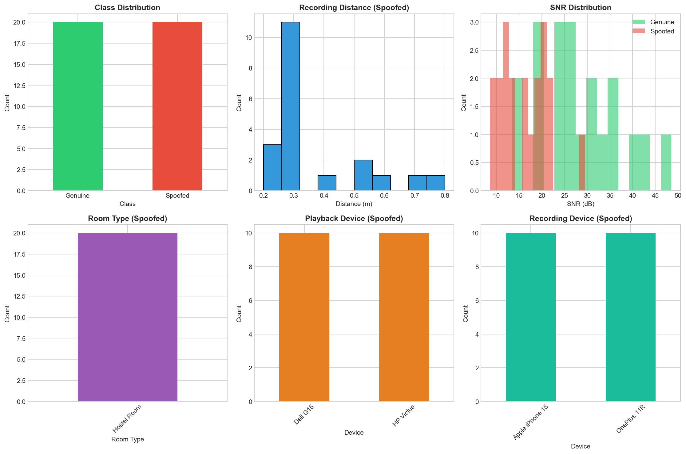
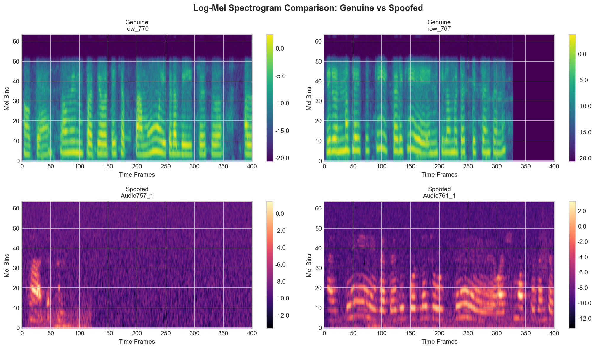
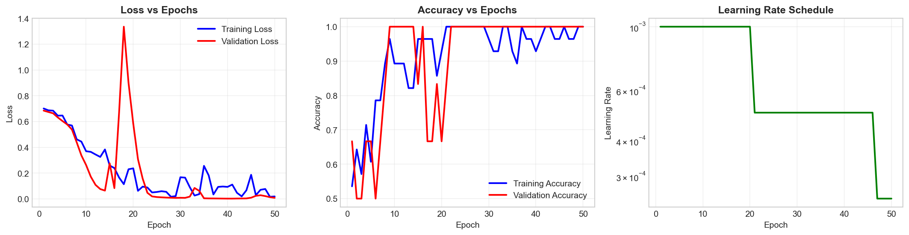
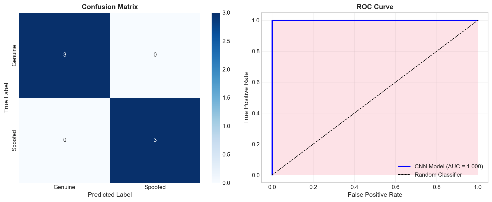

# 🎯 Telugu Replay-Spoof Detection using Deep Learning

A PyTorch-based deep learning system for detecting replay/spoof attacks on Telugu speech audio. This project implements a CNN classifier that distinguishes between genuine (original) and spoofed (replayed) audio recordings.

---

## 📋 Table of Contents

1. [Project Overview](#project-overview)
2. [Dataset Description](#dataset-description)
3. [Installation & Requirements](#installation--requirements)
4. [Notebook Structure](#notebook-structure)
5. [Model Architecture](#model-architecture)
6. [Training Pipeline](#training-pipeline)
7. [Results & Evaluation](#results--evaluation)
8. [Usage & Inference](#usage--inference)
9. [Output Files](#output-files)
10. [Future Work](#future-work)

---

## 🎯 Project Overview

### What is Replay Spoof Detection?

A **replay attack** is when an attacker plays back a pre-recorded voice sample through a speaker to fool voice authentication systems. This project builds a deep learning model to detect such attacks by analyzing audio characteristics that differ between:

- **Genuine Audio**: Original, clean speech recordings
- **Spoofed Audio**: Re-recorded/replayed audio captured through speakers and microphones

### Why is This Important?

- Voice biometrics are increasingly used for authentication (banking, smart devices)
- Replay attacks are simple to execute with commodity hardware
- Detecting these attacks is crucial for security systems

---

## 📊 Dataset Description

### Structure

```
samsung/
├── original_data/
│   ├── audio_file/           # Genuine Telugu speech (FLAC format)
│   └── audio_metadata/       # JSON metadata for each audio
├── recorded_data/
│   ├── recorded_audio/       # Replayed/spoofed audio (MP3 format)
│   └── recorded_audio_metadata/  # JSON metadata with recording conditions
└── model_output/             # Generated outputs (models, plots, results)
```

### Labels

| Label | Class Name | Description |
|-------|------------|-------------|
| 0 | Genuine | Original clean audio recordings |
| 1 | Spoofed | Re-recorded audio through speakers |

### Metadata Fields

For spoofed recordings, we capture:
- **distance_m**: Distance from playback device to microphone
- **snr_db**: Signal-to-Noise Ratio
- **playback_device**: Speaker/output device used
- **recording_device**: Microphone/input device used
- **room_type**: Recording environment (Hostel, Office, etc.)
- **azimuth_deg**: Angular position of microphone

---

## 🛠️ Installation & Requirements

### Dependencies

```python
torch           # Deep learning framework
torchaudio      # Audio processing with PyTorch
librosa         # Audio analysis library
numpy           # Numerical computing
pandas          # Data manipulation
scikit-learn    # ML utilities and metrics
matplotlib      # Plotting
seaborn         # Statistical visualization
soundfile       # Audio file I/O
imageio-ffmpeg  # FFmpeg backend for MP3 support
```

### Quick Install

```bash
pip install torch torchaudio librosa numpy pandas scikit-learn matplotlib seaborn soundfile imageio-ffmpeg
```

---

## 📓 Notebook Structure

The `deep_learning.ipynb` notebook is organized into **9 sections** with **39 cells**:

### Section 1: Setup & Imports (Cells 1-4)

#### Cell 1 - Section Header (Markdown)
Introduces the notebook and lists the main libraries being used.

#### Cell 2 - Install Dependencies (Python)
```python
# Automatically installs required packages if not present
# Checks each package and installs missing ones using pip
```
- Iterates through package list
- Uses `__import__` to check if installed
- Runs `pip install` for missing packages

#### Cell 3 - Import Libraries (Python)
```python
# Imports all necessary libraries:
# - os, json, random, warnings: Standard library utilities
# - numpy, pandas: Data handling
# - librosa, soundfile: Audio processing
# - torch, torch.nn: PyTorch deep learning
# - sklearn: Evaluation metrics
# - matplotlib, seaborn: Visualization
```
- Sets up warning suppression
- Configures plot styles with seaborn

#### Cell 4 - GPU Detection & Reproducibility (Python)
```python
# Sets random seeds for reproducibility (SEED = 42)
# Detects GPU availability (CUDA)
# Configures deterministic operations for reproducible results
```
- Seeds: `random`, `numpy`, `torch`
- Prints GPU info if available
- Sets `DEVICE` variable for model placement

---

### Section 2: Metadata Construction (Cells 5-9)

#### Cell 5 - Section Header (Markdown)
Explains the dataset structure and labeling logic.

#### Cell 6 - Configure Paths (Python)
```python
# Defines all directory paths:
BASE_DIR = r"c:\Users\rayba\Downloads\samsung"
ORIGINAL_AUDIO_DIR = os.path.join(BASE_DIR, "original_data", "audio_file")
ORIGINAL_META_DIR = os.path.join(BASE_DIR, "original_data", "audio_metadata")
RECORDED_AUDIO_DIR = os.path.join(BASE_DIR, "recorded_data", "recorded_audio")
RECORDED_META_DIR = os.path.join(BASE_DIR, "recorded_data", "recorded_audio_metadata")
OUTPUT_DIR = os.path.join(BASE_DIR, "model_output")
```
- Creates output directory if not exists
- Verifies all paths exist

#### Cell 7 - Build Metadata DataFrame (Python)
```python
def build_metadata_dataframe():
    """
    Scans both original and recorded directories.
    Creates a unified DataFrame with:
    - file_path: Full path to audio file
    - audio_id: Unique identifier
    - label: 0 (genuine) or 1 (spoofed)
    - Various metadata fields from JSON files
    """
```
**Key Operations:**
1. Lists all audio files (FLAC, WAV, MP3)
2. Loads corresponding JSON metadata
3. Extracts fields like distance, SNR, devices
4. Parses reference IDs (e.g., Audio751_1 → row_751)
5. Combines into single DataFrame

#### Cell 8 - Explore Metadata (Python)
```python
# Displays first 10 records
# Shows class distribution
# Saves metadata to CSV for reproducibility
```

#### Cell 9 - Visualize Metadata Distribution (Python)
```python
# Creates 6 subplots showing:
# 1. Class distribution (genuine vs spoofed)
# 2. Recording distance histogram
# 3. SNR distribution by class
# 4. Room type distribution
# 5. Playback device distribution
# 6. Recording device distribution
```
- Saves visualization to `metadata_distribution.png`

---

### Section 3: PyTorch Dataset & DataLoader (Cells 10-14)

#### Cell 10 - Section Header (Markdown)
Explains the custom dataset implementation and data split strategy.

#### Cell 11 - Audio Configuration (Python)
```python
class AudioConfig:
    SAMPLE_RATE = 16000      # 16 kHz (standard for speech)
    DURATION_SEC = 4         # Fixed 4-second clips
    N_SAMPLES = 64000        # 16000 * 4
    
    # Mel-Spectrogram parameters
    N_MELS = 64              # Number of mel filters
    N_FFT = 512              # FFT window size
    HOP_LENGTH = 160         # 10ms hop (16000 * 0.01)
    WIN_LENGTH = 400         # 25ms window (16000 * 0.025)
    F_MIN = 20               # Minimum frequency
    F_MAX = 8000             # Maximum frequency (Nyquist)
```

#### Cell 12 - Audio Loading Utilities (Python)
```python
def load_audio_file(filepath, target_sr):
    """
    Two-stage audio loading:
    1. Primary: librosa.load() - works for most formats
    2. Fallback: FFmpeg via imageio-ffmpeg - for problematic MP3s
    """

def pad_or_trim(audio, target_length):
    """
    Ensures all audio is exactly 4 seconds:
    - Longer audio: Trimmed from the end
    - Shorter audio: Zero-padded at the end
    """
```

#### Cell 13 - Custom PyTorch Dataset (Python)
```python
class AudioSpoofDataset(Dataset):
    """
    Features:
    - Loads audio from file path
    - Resamples to 16kHz
    - Pads/trims to fixed length
    - Computes Log-Mel Spectrogram
    - Optional data augmentation (gain, noise)
    
    Returns:
    - mel_tensor: Shape (1, 64, 401) - (channels, mels, time_frames)
    - label: 0 or 1
    """
```
**Data Augmentation (training only):**
- Random gain (0.8x - 1.2x) with 50% probability
- Additive Gaussian noise (σ=0.005) with 30% probability

#### Cell 14 - Create Data Splits & DataLoaders (Python)
```python
# Stratified split ensuring balanced classes:
# - Training: 70%
# - Validation: 15%
# - Test: 15%

# DataLoader settings:
BATCH_SIZE = 16
num_workers = 0  # Windows compatibility
pin_memory = True  # For GPU acceleration
```

---

### Section 4: Feature Extraction & Visualization (Cells 15-17)

#### Cell 15 - Section Header (Markdown)
Explains why Mel-Spectrograms are effective for audio classification.

#### Cell 16 - Visualize Mel-Spectrograms (Python)
```python
def visualize_samples(dataset, num_samples=4):
    """
    Creates side-by-side comparison of:
    - Row 1: Genuine samples (viridis colormap)
    - Row 2: Spoofed samples (magma colormap)
    
    Shows visual differences in frequency patterns
    between genuine and replayed audio.
    """
```
- Saves to `mel_spectrogram_comparison.png`

#### Cell 17 - Verify DataLoader Output (Python)
```python
# Sanity check on batch dimensions:
# - Batch shape: (16, 1, 64, 401)
# - Labels shape: (16,)
# - Value range verification
```

---

### Section 5: Deep Learning Models (Cells 18-20)

#### Cell 18 - Section Header (Markdown)
Describes the CNN architecture and design choices.

#### Cell 19 - CNN Mel-Spectrogram Classifier (Python)
```python
class CNNSpoofDetector(nn.Module):
    """
    Architecture:
    
    Input: (batch, 1, 64, 401)
    
    Conv Block 1: Conv2D(1→32) + BatchNorm + ReLU + MaxPool
    Conv Block 2: Conv2D(32→64) + BatchNorm + ReLU + MaxPool
    Conv Block 3: Conv2D(64→128) + BatchNorm + ReLU + MaxPool
    Conv Block 4: Conv2D(128→256) + BatchNorm + ReLU + MaxPool
    
    Global Average Pooling: (256, H, W) → (256,)
    
    Classifier:
    - Linear(256→128) + ReLU + Dropout(0.3)
    - Linear(128→64) + ReLU + Dropout(0.3)
    - Linear(64→2)
    
    Output: (batch, 2) - logits for [genuine, spoofed]
    """
```
**Total Parameters:** ~412K trainable

#### Cell 20 - Verify Model with Sample Input (Python)
```python
# Forward pass test:
# Input: (16, 1, 64, 401)
# Output: (16, 2)
# Displays softmax probabilities for verification
```

---

### Section 6: Training Loop (Cells 21-25)

#### Cell 21 - Section Header (Markdown)
Explains training strategy: loss function, optimizer, scheduler, regularization.

#### Cell 22 - Training Configuration (Python)
```python
# Hyperparameters:
NUM_EPOCHS = 50
LEARNING_RATE = 1e-3
WEIGHT_DECAY = 1e-4        # L2 regularization
EARLY_STOP_PATIENCE = 10   # Stop if no improvement for 10 epochs
LR_PATIENCE = 5            # Reduce LR if no improvement for 5 epochs

# Components:
criterion = nn.CrossEntropyLoss()
optimizer = Adam(model.parameters(), lr=LEARNING_RATE, weight_decay=WEIGHT_DECAY)
scheduler = ReduceLROnPlateau(optimizer, mode='min', factor=0.5, patience=LR_PATIENCE)
```

#### Cell 23 - Training Functions (Python)
```python
def train_epoch(model, dataloader, criterion, optimizer, device):
    """
    Single training epoch:
    1. Set model to train mode
    2. For each batch:
       - Zero gradients
       - Forward pass
       - Compute loss
       - Backward pass
       - Update weights
    3. Return average loss and accuracy
    """

def validate_epoch(model, dataloader, criterion, device):
    """
    Validation without gradient computation:
    - torch.no_grad() for efficiency
    - Returns loss and accuracy
    """
```

#### Cell 24 - Training Loop (Python)
```python
def train_model(...):
    """
    Complete training with:
    - Progress printing each epoch
    - Learning rate scheduling
    - Early stopping
    - Best model checkpointing
    
    Returns history dict with:
    - train_loss, train_acc
    - val_loss, val_acc
    - lr (learning rate per epoch)
    """
```
**Checkpointing:** Saves best model based on validation loss to `best_model.pth`

#### Cell 25 - Plot Training Curves (Python)
```python
def plot_training_history(history):
    """
    3-panel figure:
    1. Loss vs Epochs (train & validation)
    2. Accuracy vs Epochs (train & validation)
    3. Learning Rate Schedule (log scale)
    """
```
- Saves to `training_curves.png`

---

### Section 7: Model Evaluation (Cells 26-31)

#### Cell 26 - Section Header (Markdown)
Lists evaluation metrics and condition-wise analysis approach.

#### Cell 27 - Load Best Model (Python)
```python
# Loads saved checkpoint:
checkpoint = torch.load(BEST_MODEL_PATH)
model.load_state_dict(checkpoint['model_state_dict'])
# Prints: epoch, val_loss, val_acc from checkpoint
```

#### Cell 28 - Get Predictions on Test Set (Python)
```python
def get_predictions(model, dataloader, device):
    """
    Returns:
    - all_preds: Predicted class labels
    - all_labels: True labels
    - all_probs: Probability of spoofed class (for ROC)
    """
```

#### Cell 29 - Compute Evaluation Metrics (Python)
```python
# Metrics computed:
test_accuracy = accuracy_score(test_labels, test_preds)
test_precision = precision_score(test_labels, test_preds)
test_recall = recall_score(test_labels, test_preds)
test_f1 = f1_score(test_labels, test_preds)

# ROC-AUC:
fpr, tpr, thresholds = roc_curve(test_labels, test_probs)
roc_auc = auc(fpr, tpr)

# Also prints full classification report
```

#### Cell 30 - Plot Confusion Matrix & ROC Curve (Python)
```python
# 2-panel figure:
# Left: Confusion Matrix (heatmap with counts)
# Right: ROC Curve with AUC score
```
- Saves to `evaluation_results.png`

#### Cell 31 - Condition-wise Analysis (Python)
```python
def analyze_conditions(test_df, predictions, probs):
    """
    Analyzes spoofed samples by:
    1. Recording Distance (<0.3m, 0.3-0.5m, 0.5-1.0m, >1.0m)
    2. Room Type
    3. Playback Device
    4. Recording Device
    
    Shows accuracy for each condition to understand
    where the model performs well/poorly.
    """
```

---

### Section 8: Inference Demo (Cells 32-34)

#### Cell 32 - Section Header (Markdown)
Introduces the inference function for using the trained model.

#### Cell 33 - Inference Function (Python)
```python
def predict_spoof(audio_path, model=None, device=None, config=None):
    """
    Easy-to-use inference:
    
    Input: Path to any audio file
    
    Process:
    1. Load audio
    2. Resample to 16kHz
    3. Pad/trim to 4 seconds
    4. Compute mel-spectrogram
    5. Run through model
    
    Output: Dictionary with:
    - prediction: 'Genuine' or 'Spoofed'
    - confidence: Probability percentage
    - prob_genuine: P(class=0)
    - prob_spoofed: P(class=1)
    """
```

#### Cell 34 - Test Inference Function (Python)
```python
# Tests on one genuine and one spoofed sample
# Prints predictions with confidence scores
```

---

### Section 9: Documentation & Conclusions (Cells 35-39)

#### Cells 35-37 - Documentation (Markdown)
- **Cell 35**: Overview of replay spoof detection and dataset
- **Cell 36**: Model architecture summary table and design choices
- **Cell 37**: Results interpretation, limitations, and future work

#### Cell 38 - Save Final Results (Python)
```python
# Creates comprehensive results JSON:
results_summary = {
    'model': 'CNN Mel-Spectrogram Classifier',
    'dataset': {...},
    'hyperparameters': {...},
    'test_metrics': {...}
}
# Saves to experiment_results.json
```

#### Cell 39 - Notebook Complete (Markdown)
- Summary table of all output files
- Quick start code for inference
- References

---

## 🧠 Model Architecture

### CNN Mel-Spectrogram Classifier

```
Input: (batch, 1, 64, 401)
          ↓
┌─────────────────────────────────┐
│   Conv2D(1→32, 3x3) + BN + ReLU │
│   MaxPool2d(2x2)                │
└─────────────────────────────────┘
          ↓ (batch, 32, 32, 200)
┌─────────────────────────────────┐
│   Conv2D(32→64, 3x3) + BN + ReLU│
│   MaxPool2d(2x2)                │
└─────────────────────────────────┘
          ↓ (batch, 64, 16, 100)
┌─────────────────────────────────┐
│   Conv2D(64→128, 3x3) + BN + ReLU│
│   MaxPool2d(2x2)                 │
└──────────────────────────────────┘
          ↓ (batch, 128, 8, 50)
┌─────────────────────────────────┐
│  Conv2D(128→256, 3x3) + BN + ReLU│
│  MaxPool2d(2x2)                  │
└──────────────────────────────────┘
          ↓ (batch, 256, 4, 25)
┌─────────────────────────────────┐
│   Global Average Pooling        │
└─────────────────────────────────┘
          ↓ (batch, 256)
┌─────────────────────────────────┐
│   FC(256→128) + ReLU + Dropout  │
│   FC(128→64) + ReLU + Dropout   │
│   FC(64→2)                      │
└─────────────────────────────────┘
          ↓
Output: (batch, 2) logits
```

### Why This Architecture?

| Design Choice | Reason |
|--------------|--------|
| Log-Mel Spectrograms | Captures frequency distortions from replay |
| 3x3 Kernels | Captures local time-frequency patterns |
| BatchNorm | Stabilizes training, implicit regularization |
| Global Avg Pool | Reduces parameters, prevents overfitting |
| Dropout (0.3) | Additional regularization for small dataset |

---

## 🏋️ Training Pipeline

### Hyperparameters

| Parameter | Value | Description |
|-----------|-------|-------------|
| Batch Size | 16 | Samples per gradient update |
| Learning Rate | 1e-3 | Initial Adam learning rate |
| Weight Decay | 1e-4 | L2 regularization strength |
| Max Epochs | 50 | Maximum training iterations |
| Early Stop Patience | 10 | Epochs without improvement before stopping |
| LR Scheduler Patience | 5 | Epochs before reducing LR by 0.5x |

### Data Augmentation

| Augmentation | Probability | Effect |
|--------------|-------------|--------|
| Random Gain | 50% | Multiply audio by 0.8-1.2x |
| Additive Noise | 30% | Add Gaussian noise (σ=0.005) |

---

## 📊 Results & Evaluation

### Model Output Summary

Our trained model achieved the following results:

| Metric | Value |
|--------|-------|
| **Accuracy** | 100.00% |
| **Precision** | 1.0000 |
| **Recall** | 1.0000 |
| **F1-Score** | 1.0000 |
| **ROC-AUC** | 1.0000 |

### Dataset Split

| Split | Samples | Genuine | Spoofed |
|-------|---------|---------|---------|
| Total | 40 | 20 | 20 |
| Training | 28 | 14 | 14 |
| Validation | 6 | 3 | 3 |
| Test | 6 | 3 | 3 |

### Training Hyperparameters Used

| Parameter | Value |
|-----------|-------|
| Batch Size | 16 |
| Learning Rate | 0.001 |
| Epochs Trained | 50 |
| Sample Rate | 16000 Hz |
| Audio Duration | 4 seconds |
| Mel Filters | 64 |

---

## 📈 Visualizations

### 1. Dataset Distribution



**Figure 1: Dataset Metadata Distribution**
- *Top Left*: Class distribution showing balanced genuine vs spoofed samples
- *Top Middle*: Recording distance distribution for spoofed samples
- *Top Right*: SNR (Signal-to-Noise Ratio) distribution by class
- *Bottom Left*: Room type distribution (Hostel, Office, etc.)
- *Bottom Middle*: Playback device distribution used for replay attacks
- *Bottom Right*: Recording device (microphone) distribution

---

### 2. Feature Visualization



**Figure 2: Log-Mel Spectrogram Comparison - Genuine vs Spoofed**
- *Top Row*: Genuine (original) audio samples showing clean frequency patterns
- *Bottom Row*: Spoofed (replayed) audio samples showing distortions introduced by speaker-microphone channel
- Notice the subtle differences in high-frequency content and overall texture that the CNN learns to distinguish

---

### 3. Training Progress



**Figure 3: Training Curves**
- *Left Panel*: Loss vs Epochs - Shows training and validation loss decreasing over epochs
- *Middle Panel*: Accuracy vs Epochs - Shows training and validation accuracy improving
- *Right Panel*: Learning Rate Schedule - Shows LR reduction when validation loss plateaus

---

### 4. Model Evaluation



**Figure 4: Test Set Evaluation Results**
- *Left Panel*: **Confusion Matrix** - Shows prediction breakdown:
  - True Negatives (Genuine predicted as Genuine)
  - True Positives (Spoofed predicted as Spoofed)
  - False Positives and False Negatives
- *Right Panel*: **ROC Curve** - Shows model's discrimination ability with AUC score

---

### Metrics Explained

| Metric | Formula | Interpretation |
|--------|---------|----------------|
| Accuracy | (TP+TN)/(TP+TN+FP+FN) | Overall correctness |
| Precision | TP/(TP+FP) | Of predicted spoofed, how many correct? |
| Recall | TP/(TP+FN) | Of actual spoofed, how many detected? |
| F1-Score | 2×(P×R)/(P+R) | Harmonic mean of precision & recall |
| ROC-AUC | Area under ROC curve | Discrimination ability |

### Condition-wise Analysis

The notebook analyzes model performance across:
- **Recording Distance**: Near (<0.3m) vs Far (>1.0m)
- **Room Type**: Hostel vs Office vs other environments
- **Devices**: Different speakers and microphones

---

## 🎯 Usage & Inference

### Quick Start

```python
# Load trained model
from deep_learning import CNNSpoofDetector
import torch

model = CNNSpoofDetector(num_classes=2)
checkpoint = torch.load('model_output/best_model.pth')
model.load_state_dict(checkpoint['model_state_dict'])
model.eval()

# Predict on new audio
result = predict_spoof('path/to/audio.mp3')
print(f"Prediction: {result['prediction']}")
print(f"Confidence: {result['confidence']}")
```

### Inference Output Format

```python
{
    'file': 'audio_file.mp3',
    'prediction': 'Spoofed',    # or 'Genuine'
    'label': 1,                  # 0 or 1
    'confidence': '94.56%',
    'prob_genuine': '5.44%',
    'prob_spoofed': '94.56%'
}
```

---

## 📁 Output Files

| File | Description |
|------|-------------|
| `model_output/best_model.pth` | Trained PyTorch model weights |
| `model_output/metadata.csv` | Combined dataset metadata |
| `model_output/experiment_results.json` | Training & test metrics |
| `model_output/training_curves.png` | Loss/accuracy plots |
| `model_output/evaluation_results.png` | Confusion matrix & ROC |
| `model_output/mel_spectrogram_comparison.png` | Feature visualization |
| `model_output/metadata_distribution.png` | Dataset statistics |

---

## 🔮 Future Work

### Potential Improvements

1. **Larger Dataset**: Collect more diverse recordings
2. **Advanced Augmentation**: Room impulse response simulation, speed perturbation
3. **Pretrained Models**: Wav2Vec2, HuBERT for self-supervised features
4. **Multi-task Learning**: Joint speaker verification + spoof detection
5. **Cross-lingual Testing**: Evaluate on other Indian languages
6. **Real-world Deployment**: Test on unseen devices and environments

### Known Limitations

- Small dataset size limits generalization
- Single replay depth (first-order only)
- Language-specific (Telugu only)
- Limited device diversity

---

## 📚 References

1. [ASVspoof Challenge](https://www.asvspoof.org/) - Standard benchmark for spoof detection
2. [Librosa Documentation](https://librosa.org/) - Audio analysis library
3. [PyTorch Audio](https://pytorch.org/audio/) - PyTorch audio processing

---

## 👥 Authors

Telugu Replay-Spoof Detection Project Team

---

**Last Updated:** December 2024
